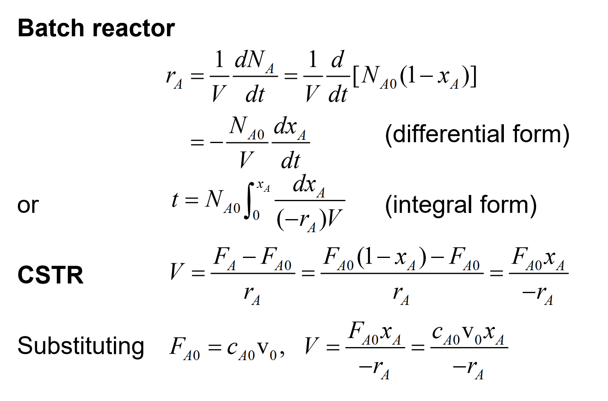
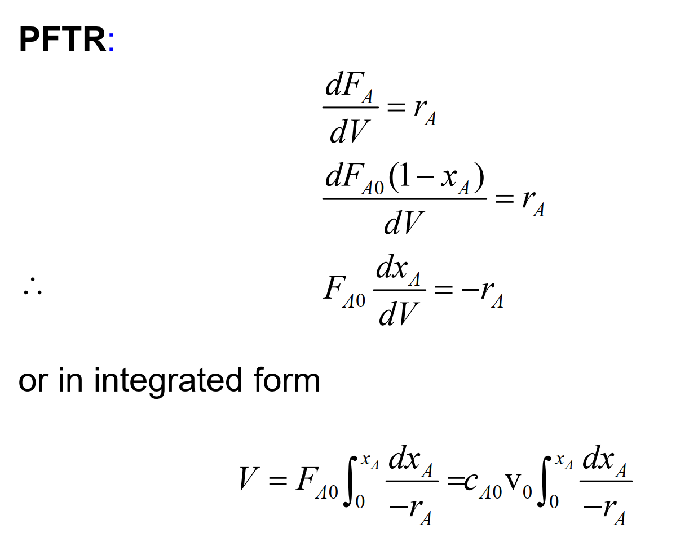

# reactor-sim
Repository for Final Year Design Project python simulation

## Task 
Design a reactor for esterification of palmitic acid with isopropanol to produce isopropyl palmitate (IPP)

### Specifications:
Target IPP Purity: 99%
Plant Capacity: 600 kilo Tonne
Feedstock: 4% Weight Palmitic Acid

Palmitic Acid Weight = 24 kilo tonne
# Reaction Information

$$
\ce{C15H31COOH  + C3H7OH<--> C19H38O2 + H2O}
$$

### Esterification

Mechanism is well-known and is a nucleophilic acyl substitution of palmitic acid
Reaction is 1st order with respect to both Palmitic Acid, Isopropanol and the catalyst H

## Thermodynamics
Reaction is a reversible one. 
Endothermic reaction -> Favoured by high temperatures 
Equilibrium pushed forward by
- Letting isopropanol be in excess
- $\ce{H2O}$ to be removed constantly 

## Kinetic/Thermodynamic Reaction Constants
*Obtained from Chin (2006)*

##
Reactor Design Equations

## Reactor 
Reactors should be held in isothermal conditions. Esterification reaction is an equilibrium reaction and if the conditions for the reactor are adiabatic, the backward reaction will be favoured with time (Le Chatlier's Principle)

1. CSTR using p-Toluene Sulfonic Acid catalyst
2. PFR using p-Toluene Sulfonic Acid
3. Packed bed Reactor using ZnA/SG 
## References

https://www.chemanalyst.com/Pricing-data/isopropyl-alcohol-31